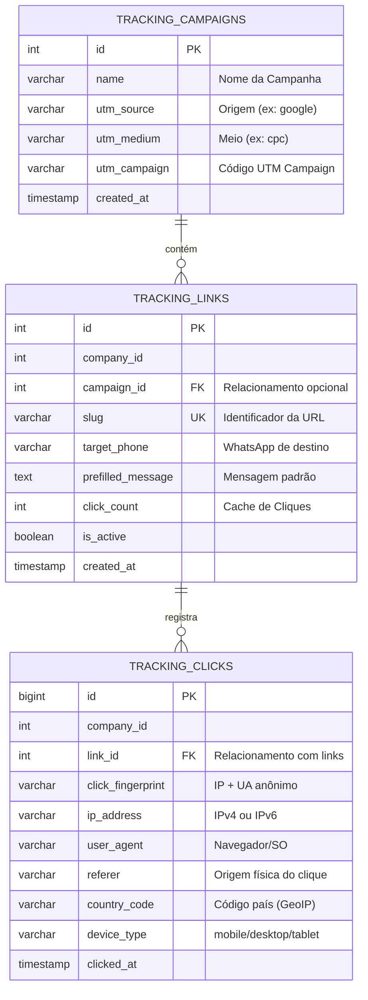

# Campaign Redirect & Click Tracking Service

[](https://www.python.org/)
[](https://fastapi.tiangolo.com/)
[](https://www.docker.com/)
[](https://www.mysql.com/)

Um serviço de redirecionamento de links de alta performance e baixa latência focado no rastreamento de cliques e atribuição de campanhas para **Marketing Digital (Tráfego Pago e Orgânico)**.

---

## 📌 Contexto de Negócio e Narrativa do Projeto

Este projeto foi concebido para resolver um desafio comum enfrentado por equipes de Growth e Marketing Digital: **atribuição de conversão e rastreabilidade de leads no canal de atendimento (WhatsApp)**. 

Ao rodar campanhas pagas (como Google Search Ads e Facebook Ads) ou orgânicas (como links na bio do Instagram e parcerias com influenciadores no YouTube), as empresas frequentemente direcionam o usuário diretamente para links do WhatsApp (`wa.me`). Contudo, ao fazer isso, perde-se completamente o rastro de qual anúncio ou criativo originou o contato (o chamado *Analytics Black Hole*).

**A Solução:**
Este microsserviço atua como um redirecionador inteligente intermediário. Quando o lead clica no link curto (ex: `links.seu-dominio.com/r/bf-google`), a aplicação intercepta a requisição, analisa os metadados do visitante de forma anônima e o redireciona instantaneamente para a API do WhatsApp com o número e a mensagem pré-configurados.

Para garantir que o redirecionamento seja ultra-rápido, a gravação de dados no banco de dados ocorre em segundo plano (assincronamente via `asyncio.create_task`), evitando que o lead sofra com lentidão na transição.

---

## 📊 Modelagem do Banco de Dados (DER)

A estrutura relacional foi modelada para garantir integridade referencial ao mesmo tempo em que otimiza consultas de grande volume (OLAP) por meio de índices apropriados em campos de data, slug e fingerprint de dispositivos.



---

## 🛠️ Tecnologias Utilizadas

- **FastAPI (Python 3.13)**: Framework assíncrono de alto desempenho usado para expor os endpoints operacionais.
- **aiomysql / PyMySQL**: Comunicação assíncrona com o MySQL prevenindo gargalos de conexão.
- **MySQL 8.0**: Banco de dados relacional para persistência transacional e relatórios analíticos.
- **Docker & Docker Compose**: Containerização total do ambiente para fácil portabilidade e implantação local.
- **Python Data Stack (Pandas, Seaborn, Matplotlib)**: Utilizados no Jupyter Notebook para gerar relatórios visuais e estatísticas.

---

## 🚀 Como Executar o Projeto Localmente

Certifique-se de possuir o [Docker](https://www.docker.com/) instalado em sua máquina.

### 1. Clonar o repositório e preparar as variáveis de ambiente:
Copie as variáveis de exemplo para o seu arquivo local:
```bash
cp .env.example .env
```

### 2. Subir os containers (Aplicação + MySQL):
```bash
docker-compose up --build -d
```
*Nota: Na primeira execução, o MySQL irá rodar automaticamente o script [schema.sql](./schema.sql) localizado na pasta de inicialização para estruturar o banco de dados.*

### 3. Verificar o status dos serviços:
Acesse o endpoint de health check no navegador para verificar se a aplicação FastAPI está conectada ao banco:
- URL: `http://localhost:8080/health`

---

## 📈 Análise de Dados e Queries Analíticas

Como Analista de Dados, estruturei uma suíte de consultas analíticas SQL em [queries_analiticas.sql](./queries_analiticas.sql) para responder a dores de negócio reais, como:
1. **Total de Cliques vs. Cliques Únicos**: Identificar usuários reais por meio da métrica de `click_fingerprint`.
2. **Padrão de Distribuição Temporal**: Rastrear horários de pico para otimização de agendamento de anúncios de tráfego pago (Ad Scheduling).
3. **Métricas de Tráfego Pago vs. Orgânico**: Comparativo do share de engajamento entre anúncios pagos e links orgânicos.
4. **Análise de Intervalo de Acesso (Lealdade)**: Window functions que medem o tempo decorrido entre cliques recorrentes de um mesmo fingerprint.

### Visualização com Jupyter Notebook
Na pasta `notebooks/`, o arquivo [analise_cliques.ipynb](./notebooks/analise_cliques.ipynb) realiza uma análise exploratória completa simulando 1500 cliques de campanhas. O notebook está documentado para expor:
- Gráficos de barra comparativos de performance de campanhas.
- Share de cliques por meio de tráfego (gráfico de pizza).
- Tendências de acesso por hora e dia de semana (gráficos de linha).
- Conclusões acionáveis sobre a otimização de orçamentos e layouts de conversão.

---

## 📁 Estrutura de Diretórios
```text
├── notebooks/
│   └── analise_cliques.ipynb   # Análise Exploratória e Visualização de Dados
├── .env.example                # Template de configuração de variáveis
├── docker-compose.yml          # Orquestrador local do banco e da aplicação
├── Dockerfile                  # Build multi-stage otimizada da aplicação FastAPI
├── main.py                     # Lógica principal do FastAPI (redirecionamento e logs)
├── queries_analiticas.sql      # Queries SQL avançadas (CTEs, Window Functions, Agregações)
├── requirements.txt            # Dependências da aplicação
└── schema.sql                  # Modelagem física DDL do banco de dados MySQL
```
